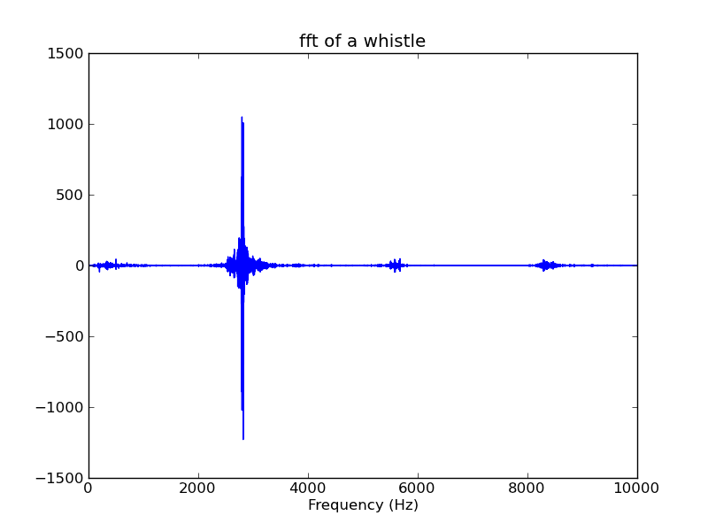
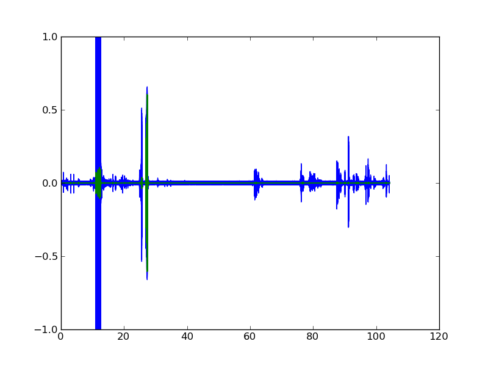

title: Synchronise video
date: 22/12/2012

I've got two cameras set up in the lab, recording the same thing but
being started at different times. I want to synchronise these
videos, both to each other and to the phenomenon that I'm looking
at.

I could of course do this by some manual method, like flicking a
light switch and searching through the video. But I get bored doing
things that I could tell a computer to do for me.

I tried finding the offset by convolving the audio streams, but this
was quite slow and could only find the camera offset, not when my
experiment started.

I tried doing a run where I blew a loud whistle when the experiment
started. The idea is that we can find the time at which this occurs
in both of the videos.

- Determine frequency of whistle.
- Strip audio from videos
- Band pass filter audio to strip non whistle information.
- Find time at which filtered data exceeds threshold.

### Whistle fourier transform ###

We need to know what frequencies we want to work with. I didn't know
the frequency of the whistle, so I cut down one of the recordings to
isolate it, then did a fourier transform on this:

    :::python
    import numpy as np
    import matplotlib.pyplot as plt
    from scikits.audiolab import wavread

    sig, fs, enc = wavread(fname)
    w = np.fft.fft(sig)
    freqs = np.fft.fftfreq(len(sig)) * fs

    fig = plt.figure()
    ax = fig.add_subplot(111)
    ax.plot(freqs, w)
    ax.set_xlim(0, 10000)
    ax.set_xlabel('Frequency (Hz)')
    ax.set_title('fft of a whistle')
    fig.savefig('whistle-fft.png')

So we can see a dominant frequency of about 2800Hz.

### Strip audio from video ###

    ffmpeg -i cam1.MOV -vn -ar 44100 -f wav cam1.wav

### Band pass filter ###

A [butterworth filter][butter] is a band pass filter designed to
have as flat as possible a response in the passband.

[butter]: en.wikipedia.org/wiki/Butterworth_filter

We're going to use a butterworth filter to try and get rid of
everything that isn't a whistle from our audio stream. Let's try a
pass band from about 2700 - 2900 Hz

    :::python
    from scipy import signal

    cam1, fs, enc = wavread('cam1.wav')
    nyq = fs / 2    # nyquist frequency
    b, a = signal.butter(3, [2700 / nyq, 2900 / nyq], btype='band')
    fcam1 = signal.lfilter(b, a, cam1)

    fig = plt.figure()
    ax = fig.add_subplot(111)
    Time = np.arange(len(cam1)) / fs
    ax.plot(Time, cam1, label='unfiltered')
    ax.plot(Time, fcam1, label='filtered')
    fig.savefig('filtered-audio.png')

We can see the whistle at about 27s, but also a load of other peaks
that have some of the same frequency content. These are actually me
clapping from trying to give the convolution method something to
work with.

Sharp noises like clapping or the sound of something being dropped
contain a wide spectrum of frequencies, meaning that they might be
mistaken for our whistle if they are loud enough. We can reduce the
impact of these noises by tightening up the band pass on the whistle
as much as we can.

### Find time at which signal exceeds threshold ###

    :::python
    time = np.where(fcam1 > 0.4)[0][0] / fs

### Cut videos down to size ###

    # given t_whistle
    ffmpeg -ss ${t_whistle} -i cam1.MOV -vcodec copy cam1-cut.MOV

### Burst video to series of images ###

This does it at a framerate of 5 Hz:

    ffmpeg -i cam1-cut.MOV -sameq -r 5 output/img_%04d.jpg
